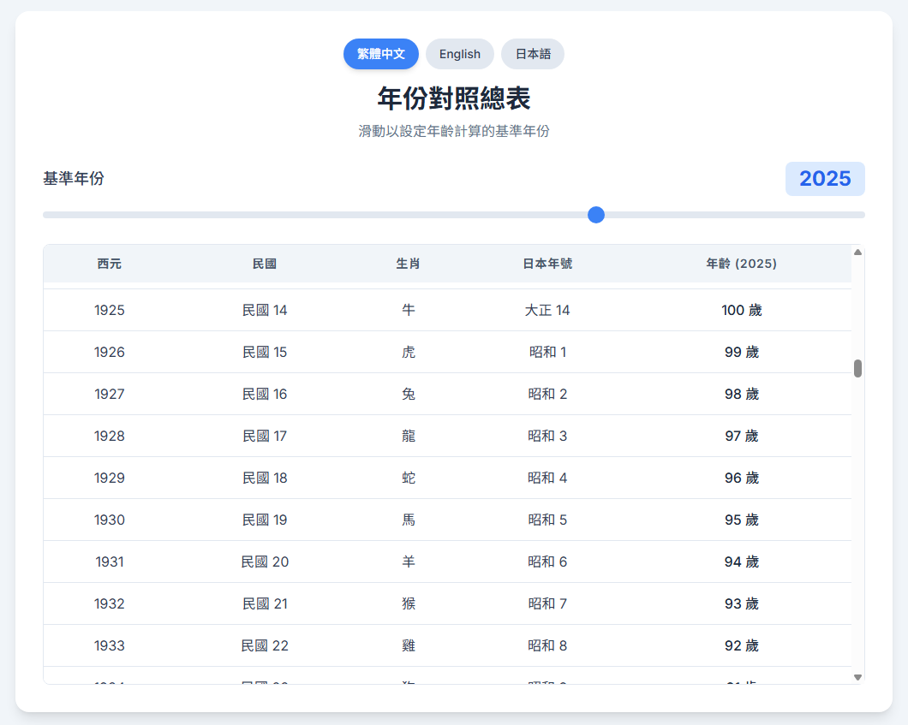
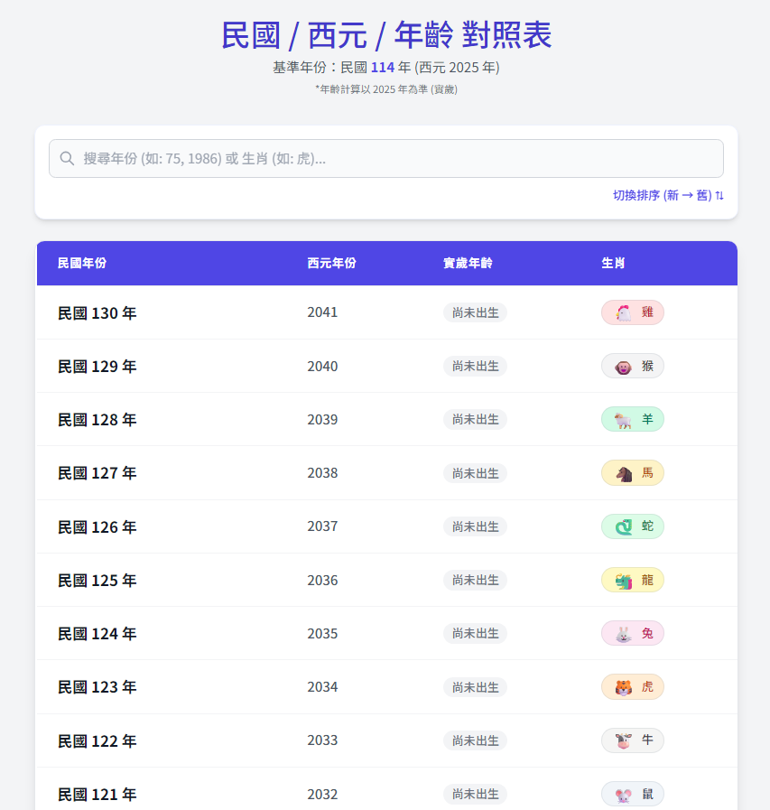

# Era-Converter

> A lightweight, single-file HTML tool for instant conversion between Western, Republic of China (ROC), and Japanese eras with dynamic age calculation.

 

[English](#english) | [中文](#中文)

---

## English

### ✨ Features

* **Multi-Calendar Conversion**: Instantly converts between **Western Year**, **ROC Year (Taiwan)**, and **Japanese Era** (Meiji, Taisho, Showa, Heisei, Reiwa), including **Chinese Zodiac** signs.
* **Dynamic Age Calculation**: Features a "Base Year" slider (range 1868–2100) that allows users to adjust the reference year, dynamically updating the age column without reloading.
* **Internationalization (i18n)**: Built-in support for **Traditional Chinese**, **English**, and **Japanese**, switchable via a simple interface.
* **Zero Dependencies**: A single-file HTML solution using Tailwind CSS (via CDN) and Vanilla JavaScript. No build process or server required.

### 🖼️ Preview

| Preview 
| :---: | 
|  |
|  | 

### 🚀 How to Use

1.  **Download**
    Simply download the `Era Converter.html` file to your local machine.

2.  **Open**
    Double-click the file to open it in any modern web browser (Chrome, Edge, Firefox, Safari).
    * *Note: An internet connection is required to load the Tailwind CSS styling via CDN.*

3.  **Interact**
    * Click the language buttons (繁體中文 / English / 日本語) to switch the UI.
    * Drag the **Base Year Slider** to change the reference year for age calculation (Default: 2025).

### ⚠️ Legal Disclaimer

This project is for **educational and research purposes only**.
* The author is not responsible for any consequences resulting from the use of this tool.
* Please ensure that your usage complies with all applicable local laws and regulations.
* Do not use this tool for any unauthorized or malicious activities.

### 📄 License

This project is licensed under the **MIT License**.

---

## 中文

### ✨ 功能特點

* **多國曆法對照**: 支援 **西元**、**民國 (ROC)** 與 **日本年號** (明治、大正、昭和、平成、令和) 的即時對照，並包含 **十二生肖** 顯示。
* **動態年齡計算**: 內建「基準年份」滑桿 (範圍 1868–2100)，拖曳即可改變計算基準，表格中的年齡數值會即時更新。
* **多語言支援**: 內建 **繁體中文**、**English** 與 **日本語** 介面切換功能。
* **單檔輕量化**: 採用單一 HTML 檔案架構，結合 Tailwind CSS (CDN) 與原生 JavaScript，無需安裝依賴或架設伺服器即可直接執行。

### 🖼️ 預覽

| 預覽圖片 | 功能描述 |
| :---: | :--- |
|  | **[主介面]** 清晰的表格視圖，展示各國年號與生肖對照。 |
|  | **[動態計算]** 拖曳滑桿時，系統會根據設定的基準年自動重新計算所有年齡。 |

### 🚀 如何使用

1.  **下載檔案**
    將 `Era Converter.html` 下載至您的電腦中。

2.  **開啟工具**
    使用任何現代瀏覽器 (Chrome, Edge, Firefox, Safari) 直接開啟該檔案。
    * *注意：由於樣式表是透過 CDN 載入，開啟時電腦需保持網路連線。*

3.  **操作說明**
    * 點擊上方的語言按鈕 (繁體中文 / English / 日本語) 切換介面語系。
    * 拖曳 **基準年份滑桿** 可變更年齡計算的基準點 (預設為 2025 年)。

### ⚠️ 免責聲明

本專案僅供 **學術研究與交流學習** 之用。
* 使用者需自行承擔使用本工具所產生的一切後果，作者不負任何責任。
* 請確保您的使用行為符合當地法律法規。
* 嚴禁將本工具用於任何未經授權的攻擊或非法用途。

### 📄 授權條款

本專案採用 **MIT License** 開源授權。
